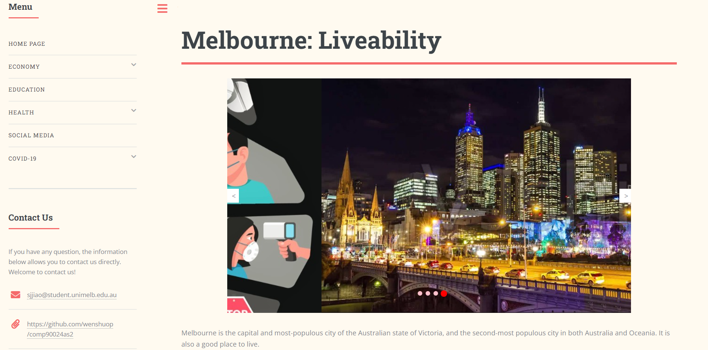

# COMP90024 Assginment2 -- Group 13

### Contributors
<table>
  <tr>
    <td align="center"><a href="https://github.com/luck617"><br /><sub><b>Suyi Jiao</b></sub></a><br /></td>
    <td align="center"><a href="https://github.com/cocoqiu51"><br /><sub><b>Jing Qiu</b></sub></a><br /></td>
    <td align="center"><a href="https://github.com/wenshuop"><br /><sub><b>Wenshuo Pan</b></sub></a><br /></td>
    <td align="center"><a href="https://github.com/MEIJUN-YUE"><br /><sub><b>Meijun Yue</b></sub></a><br /></td>
    <td align="center"><a href="https://github.com/TinaWuuu"><br /><sub><b>Yeting Wu</b></sub></a><br /></td>
  </tr>
</table>

###  Analyse Melbourne Livability
We show a Cloud-based solution in detail. This solution presents the results of our data very well. We discuss 5 scenarios to explore the livability of Melbourne.  
From the scenario of economy, Melbourne has the largest number of micro enterprises, compared to other cities. Melbourne also has many large enterprises. In terms of income status, Melbourne has a relatively balanced income distribution. Therefore, the economy of Melbourne is still growing nicely.  
In education, the number of people having 12 schooling is more than other cities. This indicated that Melbourne has a more academic atmosphere than other cities.   
However, in health, the vaccination rate in Melbourne is lower. That means the protection awareness of Melbourne residents needs to be improved. The house price of Melbourne is higher than other cities. This is very stressful for people who have not bought a house or are immigrants.  
After analyzing the tweets data, Melbourne has slightly more optimistic residents overall than the other six cities. So, in humanities, most of Melbourne's residents remain optimistic during the epidemic which is better than other cities. this is a good evidence for livability.   
In a summary, although there can be some drawbacks of living in Melbourne, they can be overcome and won't affect the liveability too much. From our analysis, Melbourne is a highly liveable city.  



### Architecture


### Demonstration Video
https://www.youtube.com/watch?v=k2DycYtT0Rc&list=PLNgKTEWVQVJ2BPFCvASUQGAbYBHzL-Ih3&index=4&t=9s

### Directory Structure
```js
|-- doc //  documents
|-- mrc // deployment
|-- supplement_data_analysis // supplementary data harvest and processing
|-- twitter // twitter data harvest and processing
|-- website_build // front-end and back-end services
```

### How to Run
***Make sure the UniMelb VPN is correctly configured and connected before continuing.*** 
#### Install ansible
##### Linux

```
sudo apt install ansible
```

##### MacOS

```
brew install ansible
```
#### Enter the deployment folder
```
cd mrc
```
#### Create instances
```
./run-deploy-instance.sh
```
#### Deploy the Docker
```
./run-deploy-docker.sh
```
#### Deploy the CouchDB
```
./run-deploy-couchdb.sh
```
#### Deploy the data harvest and processing
```
./deploy-harvest-search.sh 
./deploy-harvest-streaming.sh
./run-deploy-supplement-data-analysis.sh
```
#### Deploy the Website
```
/run-deploy-web.sh
```
