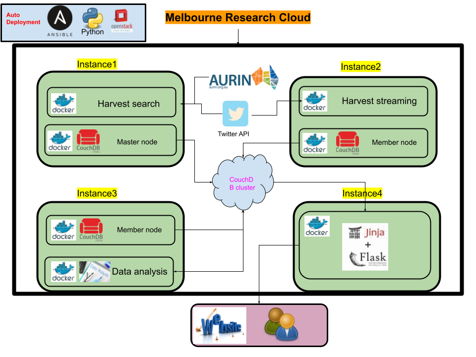

# COMP90024 Assginment2 -- Group 13

### Contributors
<table>
  <tr>
    <td align="center"><a href="https://github.com/luck617"><br /><sub><b>Suyi Jiao</b></sub></a><br /></td>
    <td align="center"><a href="https://github.com/cocoqiu51"><br /><sub><b>Jing Qiu</b></sub></a><br /></td>
    <td align="center"><a href="https://github.com/wenshuop"><br /><sub><b>Wenshuo Pan</b></sub></a><br /></td>
    <td align="center"><a href="https://github.com/MEIJUN-YUE"><br /><sub><b>Meijun Yue</b></sub></a><br /></td>
    <td align="center"><a href="https://github.com/TinaWuuu"><br /><sub><b>Yeting Wu</b></sub></a><br /></td>
  </tr>
</table>

###  Analyse Melbourne Livability


### Architecture


### Demonstration Video

### Directory Structure
```js
|-- doc //  documents
|-- mrc // deployment
|-- supplement_data_analysis // supplementary data harvest and processing
|-- twitter // twitter data harvest and processing
|-- website_build // front-end and back-end services
```

### How to Run
***Make sure the UniMelb VPN is correctly configured and connected before continuing.*** 
#### Install ansible
##### Linux

```
sudo apt install ansible
```

##### MacOS

```
brew install ansible
```
#### Enter the deployment folder
```
cd mrc
```
#### Create instances
```
./run-deploy-instance.sh
```
#### Deploy the Docker
```
./run-deploy-docker.sh
```
#### Deploy the CouchDB
```
./run-deploy-couchdb.sh
```
#### Deploy the data harvest and processing
```
./deploy-harvest-search.sh 
./deploy-harvest-streaming.sh
./run-deploy-supplement-data-analysis.sh
```
#### Deploy the Website
```
/run-deploy-web.sh
```
